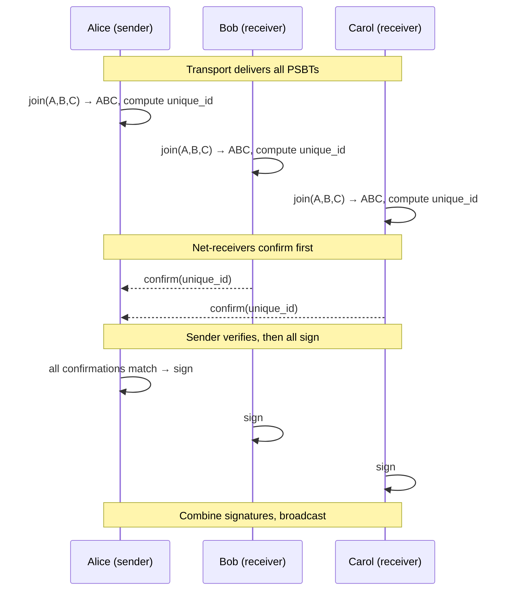
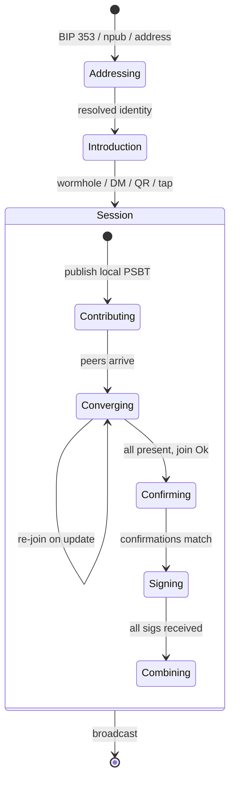
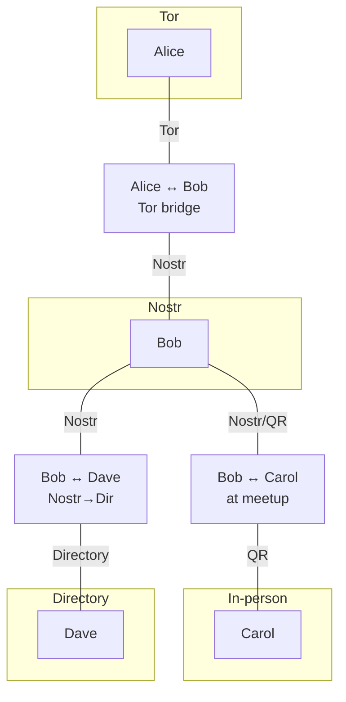

# Collaborative Transaction Construction

# Protocol Reference

> This is the comprehensive reference document. For the overview,
> start with [README.md](README.md).
>
> Sections of this document have been extracted into focused files:
>
> - [Transports](transports.md) (Layer 3 + bridging)
> - [Traits](traits.md) (IO boundary definitions)
> - [Security](security.md) (threat model)
>
> This document retains the full protocol stack (Layers 1-5),
> session lifecycle, wallet integration guide, and confirmation
> protocol details.

## Why this exists

Bitcoin Core's `joinpsbts` duplicates outputs when joining a PSBT with
itself. Its `combinepsbt` rejects PSBTs with different unsigned
transactions. Neither is safe for asynchronous, multi-party transaction
construction.

`concurrent-psbt` fixes this with a lattice-based join that is
idempotent, commutative, and associative. Every merge path converges to
the same result. Copies can arrive out of order, be redundant, or pass
through intermediaries. The math doesn't care.

This document describes how to get PSBTs from point A to point B.

## The insight

The lattice join needs exactly two properties from a transport:

1. Eventually deliver each message to all participants
1. Messages are opaque byte blobs

That's it. No ordering. No deduplication. No conflict resolution. The
lattice handles all of that. This means the transport layer is genuinely
pluggable: anything that can move bytes between people works.

## Protocol stack

```
Layer 5: Finalization     sign, combine signatures, broadcast
Layer 4: Confirmation     verify PSBT unique ID matches across peers
Layer 3: Transport        exchange PSBTs, converge via lattice join
Layer 2: Introduction     establish ephemeral session between peers
Layer 1: Addressing       who am I paying? how do I name them?
```

The library handles layers 3-5. The CLI orchestrates layers 1-2. Each
layer has multiple implementations. Wallet developers choose the
combination that fits their users.

## Layer 1: Addressing — who am I paying?

This layer is independent of the construction protocol. It answers
"how do I name the person I want to transact with?"

| Mechanism | Standard | Properties |
|---|---|---|
| On-chain address | BIP 321 URI | One-time, no interaction |
| Silent payment | BIP 352 (`sp` in BIP 321) | Reusable, no interaction |
| DNS name | BIP 353 (`₿user@domain`) | Human-readable, resolves to BIP 321 |
| Nostr npub | NIP-05 (`user@domain` → npub) | Social identity, relay discovery |
| Lightning offer | BOLT 12 (`lno` in BIP 321) | Reusable, interactive |

A BIP 353 DNS record resolves to a BIP 321 URI. The URI could include
a query parameter advertising collaborative construction capability:

```
bitcoin:?sp=sp1q...&ptj=nostr:npub1...
bitcoin:?sp=sp1q...&ptj=directory:https://payjo.in
```

This says: "pay me via silent payment, and if you want to construct a
transaction together, reach me here." The `ptj` parameter is a hint,
not required for payment. A wallet that doesn't understand `ptj` ignores
it and pays normally.

## Layer 2: Introduction — establishing a session

Three modes, from easiest to most integrated:

**One-shot (magic wormhole):** For strangers. No prior relationship.

```
Alice: ptj net create  →  7-guitarist-revenge
Bob:   ptj net join 7-guitarist-revenge
```

The wormhole transfers ~100 bytes (a session ticket) in ~2 seconds.
After that, communication switches to the chosen transport. Simple,
memorable codes. Works across any network boundary.

**Contact-based (nostr DM):** For recurring collaborators who know
each other's npubs. Session invitation via NIP-44 encrypted DM.

```
Alice: ptj net create --peers bob,carol
```

No codes, no scanning. The invitation contains the session ticket.
Peers auto-join if listening. Async: Bob can accept hours later.

**Contact-based (direct):** For peers with direct connectivity.
Iroh NodeIds or Tor onion addresses.

```
Alice: ptj net create --iroh-peers <node_id>
```

No intermediary. Both must be online.

## Layer 3: Transport — exchanging PSBTs

### The trait

```rust
trait CollaborativeMessageSet {
    type Message;
    type Error;

    /// Publish a message to all participants.
    async fn write(&self, message: Self::Message) -> Result<(), Self::Error>;

    /// Read all messages, including those from other participants.
    fn read(&self) -> impl Stream<Item = Result<Self::Message, Self::Error>>;
}
```

Each participant writes their PSBT, reads everyone's, and computes
the join locally. The trait is deliberately minimal. A new transport
is a new impl, nothing else.

### Interface specifications

For out-of-process transports, two interface specifications allow
any language to implement a transport:

**Cap'n Proto schema** for transport plugins as external binaries.
The host (`ptj`) spawns the transport process and communicates via
stdin/stdout using Cap'n Proto RPC. The transport binary is a
capability: it can read and write messages, nothing else.

```capnp
interface Transport {
    write @0 (message :Data) -> ();
    read  @1 () -> (stream :MessageStream);
}

interface MessageStream {
    next @0 () -> (message :Data, done :Bool);
}
```

**WIT (WASM Interface Types)** for transport plugins as WASM
components. The host loads the transport as a WASM component and
calls it through the WIT interface. Object capabilities are
enforced by the WASM sandbox: the transport can only do what the
host grants it.

```wit
interface transport {
    write: func(message: list<u8>) -> result<_, string>;
    read: func() -> list<list<u8>>;
}

world ptj-transport {
    export transport;
}
```

WASM components are portable (any OS, any architecture), sandboxed
(no filesystem, no network unless granted), and composable (chain
transports, add encryption, add logging). This is the future:
wallets ship transport plugins as `.wasm` files, users mix and
match without trusting native code.

### High-impact transports

These cover the most users with the least integration effort.

#### Payjoin Directory (linked mailboxes)

The `DirectoryLinkedMailbox` from rust-payjoin. Mailbox IDs derived
from `H(shared_secret || index)`. Writers walk forward on HTTP 409
(collision). Readers poll sequentially until timeout.

```
✅ OHTTP metadata privacy (relay can't read content or identify peers)
✅ Existing infrastructure (payjoin directory servers already deployed)
✅ Async (offline delivery)
✅ Simple implementation (~200 lines)
⚠️ Polling, not push
⚠️ Single directory = availability risk
⚠️ Mailbox fingerprinting (all participants read all slots)
```

Future: server-side append semantics (one mailbox, concatenated
writes), set reconciliation (minisketch/IBLT), sharding across
directories. See the discussion on
[rust-payjoin PR #5](https://github.com/0xZaddyy/rust-payjoin/pull/5).

**Best for:** Privacy-focused users, payjoin ecosystem integration.

#### Animated QR codes

Two phones (or phone + hardware wallet) face each other. The PSBT
is fountain-coded across animated QR frames. No network, no files,
completely air-gapped.

PSBTs are typically 1-10 KB. At 30 fps with ~2 KB per frame
(high-density QR), a 5 KB PSBT transfers in under a second. Larger
transactions (many inputs) take a few seconds.

Existing implementations: Sparrow Wallet, Keystone hardware wallet,
URs (Uniform Resources from Blockchain Commons). The UR standard
provides fountain codes over QR with error correction and
multi-part sequencing.

```
✅ Air-gapped (no network at all)
✅ Works with hardware wallets
✅ No installation on the scanning side (camera app)
✅ Visual confirmation ("I can see it working")
❌ Requires physical proximity
❌ Two-way exchange needs two cameras
```

**Best for:** Hardware wallet users, security-maximalist setups,
in-person transactions.

#### Nostr (mdk / whitenoise)

NIP-44 encrypted DMs for two-party. MLS groups via whitenoise/mdk
for multi-party. Relays provide redundancy and offline delivery.

```
✅ Async (push notifications possible via relay-specific mechanisms)
✅ Relay redundancy (write to multiple, read from any)
✅ Identity reuse (npub = long-term identity)
✅ MLS forward secrecy for group sessions
✅ Large existing user base
⚠️ Relay metadata (who talks to whom, timing)
⚠️ MLS adds complexity for multi-party
```

The npub serves double duty: layer 1 (addressing, via NIP-05) and
layer 2 (introduction, via NIP-44 DM). A wallet that already uses
nostr for contacts gets collaborative transactions for free.

**Best for:** Nostr-native wallets, recurring collaborators,
mobile wallets with push notification support.

#### WebRTC (browser)

No installation. A web page at `ptj.dev/join/CODE` runs the lattice
join in WASM. The signaling server sees connection metadata but not
content (DTLS encrypted peer-to-peer).

```
✅ Zero installation (works in any browser)
✅ Lowest barrier to entry
✅ E2E encrypted (DTLS)
✅ P2P after signaling (low latency)
⚠️ Signaling server metadata
⚠️ Browser security model (no hardware wallet integration)
⚠️ WASM PSBT signing requires key in browser memory
```

The web page could be a "join this transaction" link that the
recipient opens. The sender's wallet connects via WebRTC. The
lattice join runs in WASM on both sides.

**Best for:** Onboarding new users, casual transactions, "just
send them a link" UX.

### Additional transports

These serve specific niches or provide defense in depth.

#### Iroh (documents)

Each peer publishes their PSBT as an iroh document entry. Iroh's
set reconciliation protocol (range-based sync) ensures all peers
eventually converge.

```
✅ True P2P (no central server required)
✅ Efficient sync (delta-only)
✅ NAT traversal via iroh relay
✅ Late joiners catch up automatically
❌ Both peers must be online (or use relay)
❌ No offline delivery
```

**Best for:** Desktop wallets, developers, P2P-maximalist setups.

#### Tor onion services

Each peer runs a hidden service. No relay metadata at all. The
strongest network anonymity available.

```
✅ True anonymity (no metadata leakage)
✅ No trust in any intermediary
❌ Both peers must be online
❌ Slow to establish (~30 seconds)
❌ Tor must be installed
```

**Best for:** High-value transactions, privacy maximalists.

#### Matrix (E2E encrypted rooms)

Room = session. Olm/Megolm encryption. Already used by Bitcoin
projects for coordination.

```
✅ Async delivery
✅ E2E encrypted
✅ Bridges to other protocols
✅ Good for organizations
⚠️ Homeserver metadata
```

**Best for:** Organizations, treasury operations, teams.

#### Bluetooth / WiFi Direct

Local network, no internet. Discovery via QR code or NFC tap for
pairing. Good for in-person group coinjoins.

```
✅ No internet required
✅ Low latency
✅ NFC tap for easy pairing
❌ Proximity required
❌ Platform-specific APIs
```

**Best for:** Meetup coinjoins, point-of-sale, local groups.

#### NFC tap

Simplest possible UX for small PSBTs. Tap phones together. Android
supports host card emulation. Limited payload but PSBTs compress
well. Two taps: one to send, one to receive the joined result.

**Best for:** Quick two-party transactions, mobile-first UX.

#### Email (PGP/age encrypted)

The original async transport. `ptj` reads PSBTs from stdin or
attachments. Everyone has email. Lowest common denominator.

```
ptj join <(gpg -d alice.psbt.gpg) <(gpg -d bob.psbt.gpg)
```

**Best for:** Fallback, compatibility, non-technical users.

#### IPFS / IPNS

Publish PSBT to IPFS, share the CID. Content-addressed: anyone
with the CID can retrieve from any node. IPNS for mutable pointers.

**Best for:** Public/transparent collaborative transactions,
crowdfunding, auditable construction.

#### Meshtastic / LoRa / Reticulum

Off-grid mesh networking. Very low bandwidth (~200 bytes/sec) but
PSBTs compress to a few KB. Works without internet infrastructure.
Reticulum is transport-agnostic (LoRa, serial, TCP, I2P).

**Best for:** Disaster scenarios, remote areas, extreme censorship
resistance.

## Layer 4: Confirmation

Following the spec (§ Confirmation of successful payment prior to
signing). Transport-independent: confirmation messages use the same
channel as PSBT exchange.



Net-receivers can confirm immediately (their outputs are in the
join). Net-senders wait for all their receivers' confirmations.
Cyclic payment graphs are broken by net-positive receivers
confirming first.

## Layer 5: Finalization

Standard BIP 174/370: `combinepsbt` → `finalizepsbt` → broadcast.
No custom logic needed.

## For wallet developers

### Minimum viable integration

The smallest useful integration is sneakernet: add "Export PSBT" and
"Import PSBT" buttons. Use `concurrent-psbt` for the join instead of
Bitcoin Core's `combinepsbt`. Your users can already do collaborative
transactions via files, AirDrop, or messaging apps.

This is ~50 lines of code and zero new dependencies beyond the
library.

### Next step: animated QR

If your wallet already has a camera (most mobile wallets do), add
animated QR send/receive using the UR standard. Now your users can
do air-gapped collaborative transactions by pointing phones at each
other. This works with hardware wallets that support URs.

### Full network integration

Implement `CollaborativeMessageSet` for your preferred transport.
The trait is two methods. The lattice join is one function call.
The rest is UX: session management, peer discovery, progress
display.

```rust
// Pseudocode for a wallet integration
let my_psbt = wallet.create_psbt(inputs, outputs);
let transport = NostrTransport::new(session_npub, relays);
transport.write(my_psbt.serialize()).await;

let mut joined = my_psbt.wrap();
for msg in transport.read() {
    let peer_psbt = parse(msg);
    joined = joined.join(peer_psbt.wrap());
}

if joined.is_ok() {
    let final_psbt = joined.try_unwrap().unwrap();
    wallet.sign(final_psbt);
}
```

### WASM transport plugins

Ship transport plugins as `.wasm` components. Users install them
like browser extensions. The WASM sandbox provides object
capabilities: a transport plugin can read and write messages, but
cannot access the filesystem, make arbitrary network connections,
or see the wallet's keys.

A wallet that supports WASM transport plugins gets every transport
for free: any developer can write a transport plugin in any language
that compiles to WASM, and any user can install it without trusting
native code.

## Session lifecycle



## Transport bridging

A peer connected to two transports is a bridge. They read PSBTs
from one transport and write them to the other. The lattice join
makes this free: no translation, no conflict resolution, no
protocol negotiation. A PSBT is a PSBT regardless of how it
arrived.

### Why this works

Consider Alice (on Tor), Bob (on iroh and Tor), and Carol (on
iroh):


Alice publishes her PSBT over Tor. Bob receives it, joins it with
his own, and publishes the result on both Tor (back to Alice) and
iroh (to Carol). Carol receives AB via iroh, joins it with hers,
and publishes ABC on iroh. Bob receives ABC from Carol, publishes
it on Tor. Alice receives ABC from Bob.

Everyone converges on the same join. Bob doesn't need special
bridging logic. He's just a participant who happens to be on two
networks. Every PSBT he receives gets joined into his local state,
and his local state gets published to all his transports.

The lattice guarantees that redundant copies are absorbed
(idempotent), arrival order doesn't matter (commutative), and
partial merges compose correctly (associative). So Bob publishing
the same PSBT to both Tor and iroh is harmless. Carol receiving
it from Bob when she already has her own version is harmless.
Alice receiving AB when she already has A is just an update.

### Heterogeneous sessions

In practice, different participants will be on different transports
for different reasons:

- Alice is privacy-focused: Tor onion service, no relays
- Bob is mobile: nostr for push notifications
- Carol is at a meetup: animated QR, no internet
- Dave is an enterprise user: payjoin directory via OHTTP

Nobody needs to agree on a transport. Each participant uses
whatever they prefer. Any participant who shares a transport with
another forms a bridge. The session is the union of all transports,
connected by the participants who span them.



Bob is the hub here, but there's no coordinator role. If Bob goes
offline, Alice and Dave can still bridge through another path (or
someone can carry a file). The lattice doesn't care about topology.

### Introduction across transports

The wormhole code is transport-agnostic. When Alice creates a
session, the wormhole exchange transfers a session ticket. The
ticket can contain multiple transport endpoints:

```json
{
  "tor": "abcdef.onion:9735",
  "nostr": "npub1...",
  "directory": "https://payjo.in/session/xyz",
  "iroh": "node_id:..."
}
```

The joining peer picks whichever transport they support. If they
support multiple, they connect to all of them and act as a bridge.
The introduction mechanism (wormhole, nostr DM, QR code) is itself
independent of the transports it bootstraps.

### WASM transport composition

With WASM transport plugins, bridging becomes composition. A bridge
is a component that reads from one transport and writes to another:

```wit
world ptj-bridge {
    import source: transport;
    import sink: transport;
    export bridge: transport;
}
```

The host composes: `bridge(tor-transport, iroh-transport)`. The
bridge component reads from Tor, writes to iroh, and vice versa.
Object capabilities ensure the bridge can only access the two
transports it's given, nothing else.

This is the UNIX pipe philosophy applied to transports: small
components, composed freely, sandboxed by default.

## Trait boundaries

The core library is IO-free. It processes PSBTs and produces results.
All IO (network, filesystem, user interaction) lives outside the
library, behind trait boundaries.

This separation enables three usage modes from the same trait suite:

- **CLI batch**: read files, call traits once, write result
- **Interactive session**: poll a message store in a loop, react to
  state changes
- **Out-of-process plugin**: Cap'n Proto RPC or WASM component, each
  trait method is an RPC call

### The IO-free core

```rust
// Already exists in the library:
trait Join { fn join(self, other: Self) -> Self; }

// The core operation, IO-free:
fn process(state: JoinState, message: &[u8]) -> Result<JoinState, Error>;
fn export(state: &JoinState) -> Result<Vec<u8>, Error>;
```

The core never reads from the network, never writes to disk, never
blocks. It takes bytes in, returns bytes out. Everything else is the
caller's responsibility.

### Transport

The transport boundary. Decouples "where do messages come from" from
"how do I join them."

```rust
trait Transport {
    type Error;
    fn publish(&mut self, message: Vec<u8>) -> Result<(), Self::Error>;
    fn collect(&self) -> Result<Vec<Vec<u8>>, Self::Error>;
}
```

Implementations:

- `MemoryStore`: `Vec<Vec<u8>>`. For CLI `ptj join a.psbt b.psbt`.
- `DirectoryStore`: wraps `DirectoryLinkedMailbox`.
- `NostrStore`: wraps mdk, reads/writes via NIP-44 DMs or MLS group.
- `IrohStore`: wraps iroh document entries.
- `FileStore`: watches a directory for `.psbt` files. Sneakernet.

The interface is synchronous and pull-based. An async caller polls
`collect()` periodically. A CLI caller calls `collect()` once. The trait
doesn't prescribe timing.

```capnp
interface Transport {
    put  @0 (message :Data) -> ();
    list @1 () -> (messages :List(Data));
}
```

```wit
interface message-store {
    put: func(message: list<u8>) -> result<_, string>;
    list: func() -> list<list<u8>>;
}
```

Both Cap'n Proto and WIT use the same pull-based interface. For
push-based transports (nostr relay notifications, iroh sync events),
the transport implementation converts push to pull internally: the
push handler appends to a buffer, `collect()` drains it.

### Introducer

The session establishment boundary. Produces or consumes a session
ticket.

```rust
trait Introducer {
    type Error;
    fn create_session(&mut self, local_psbt: &[u8])
        -> Result<SessionOffer, Self::Error>;
    fn join_session(&mut self, ticket: &SessionTicket)
        -> Result<(), Self::Error>;
}

struct SessionOffer {
    ticket: SessionTicket,
    display_code: Option<String>,  // "7-guitarist-revenge"
}

struct SessionTicket {
    data: Vec<u8>,  // opaque, transport-specific
}
```

Implementations:

- `WormholeIntroducer`: magic-wormhole-rs. Creates code, exchanges
  ticket.
- `NostrIntroducer`: sends NIP-44 DM with ticket to known npubs.
- `DirectIntroducer`: ticket is a pre-shared iroh NodeId or onion
  address.
- `FileIntroducer`: reads/writes ticket to a file. For scripting.
- `QrIntroducer`: displays ticket as QR, scans peer's QR.

The introducer is called once per session. After introduction, the
`Transport` handles ongoing communication.

```capnp
interface Introducer {
    createSession @0 (localPsbt :Data) -> (offer :SessionOffer);
    joinSession   @1 (ticket :Data) -> ();
}

struct SessionOffer {
    ticket      @0 :Data;
    displayCode @1 :Text;
}
```

```wit
interface introducer {
    record session-offer {
        ticket: list<u8>,
        display-code: option<string>,
    }
    create-session: func(local-psbt: list<u8>)
        -> result<session-offer, string>;
    join-session: func(ticket: list<u8>) -> result<_, string>;
}
```

### Session

The state machine boundary. Drives the join, confirmation, and
export steps. IO-free: the caller feeds messages in and reads
state out.

```rust
struct Session { /* ... */ }

impl Session {
    fn new(local_psbt: Vec<u8>, expected_peers: Option<usize>) -> Self;

    /// Feed a serialized PSBT. Idempotent (lattice absorbs dupes).
    fn process(&mut self, message: &[u8]) -> Result<Phase, Error>;

    /// Current phase.
    fn phase(&self) -> Phase;

    /// Export the joined PSBT (if conflict-free).
    fn export(&self) -> Result<Vec<u8>, Error>;

    /// Export the joined state even with conflicts (for diagnostics).
    fn export_raw(&self) -> Result<&JoinedState, Error>;

    /// Record a peer's confirmation.
    fn add_confirmation(&mut self, peer_id: &[u8], unique_id: &[u8]);

    /// Generate this peer's confirmation (if join is clean).
    fn local_confirmation(&self, peer_id: &[u8]) -> Option<Confirmation>;
}

enum Phase {
    Contributing,  // no peer PSBTs yet
    Converging,    // join has conflicts or missing peers
    Confirming,    // join is clean, awaiting confirmations
    Ready,         // all confirmations match, ready to sign
}

struct Confirmation {
    peer_id: Vec<u8>,
    unique_id: Vec<u8>,
}
```

The CLI flow:

```rust
let mut session = Session::new(my_psbt, None);
for file in &files {
    session.process(&fs::read(file)?)?;
}
assert!(session.phase() == Phase::Ready);
let result = session.export()?;
```

The network flow:

```rust
let mut session = Session::new(my_psbt, Some(3));
store.publish(my_psbt)?;
loop {
    for msg in store.collect()? {
        session.process(&msg)?;
    }
    match session.phase() {
        Phase::Confirming => {
            let conf = session.local_confirmation(my_id).unwrap();
            store.put(serialize_confirmation(&conf))?;
        }
        Phase::Ready => break,
        _ => sleep(poll_interval),
    }
}
let result = session.export()?;
sign_and_broadcast(&result);
```

The Cap'n Proto flow (external process):

```
host                          transport plugin
 |                                 |
 |-- createSession(my_psbt) ------>|
 |<-- offer(ticket, code) ---------|
 |                                 |
 |  (user shares code)             |
 |                                 |
 |-- collect() ---------------------->|  (poll loop)
 |<-- [msg1, msg2] ---------------|
 |                                 |
 |  session.process(msg1)          |
 |  session.process(msg2)          |
 |  session.phase() == Confirming  |
 |                                 |
 |-- publish(confirmation) ----------->|
 |                                 |
 |-- collect() ---------------------->|
 |<-- [msg1, msg2, msg3, conf] ---|
 |                                 |
 |  session.phase() == Ready       |
 |  session.export() -> result     |
```

The Session processes messages but never sends them. The caller
decides what to write to the store and when. This inversion is
what makes the core IO-free: the Session is a pure function from
messages to state.

```capnp
interface Session {
    process         @0 (message :Data)     -> (phase :Phase);
    phase           @1 ()                  -> (phase :Phase);
    export          @2 ()                  -> (psbt :Data);
    addConfirmation @3 (peerId :Data,
                        uniqueId :Data)    -> (phase :Phase);
    localConfirmation @4 (peerId :Data)    -> (confirmation :Confirmation);
}

enum Phase {
    contributing @0;
    converging   @1;
    confirming   @2;
    ready        @3;
}

struct Confirmation {
    peerId   @0 :Data;
    uniqueId @1 :Data;
}
```

```wit
interface session {
    enum phase {
        contributing,
        converging,
        confirming,
        ready,
    }

    record confirmation {
        peer-id: list<u8>,
        unique-id: list<u8>,
    }

    process: func(message: list<u8>) -> result<phase, string>;
    phase: func() -> phase;
    export: func() -> result<list<u8>, string>;
    add-confirmation: func(peer-id: list<u8>, unique-id: list<u8>)
        -> phase;
    local-confirmation: func(peer-id: list<u8>)
        -> option<confirmation>;
}
```

### OutputMerger

The pre-sorting step from the spec: "Outputs with an identical
`PSBT_OUT_SCRIPT` can be merged, and their values summed."

```rust
/// Merge outputs sharing a script_pubkey by summing their amounts.
/// Called after join converges, before sorting.
/// Returns the number of outputs merged (0 = no duplicates).
fn merge_same_script_outputs(psbt: &mut UnorderedPsbt) -> usize;
```

This is a plain function, not a trait. It's part of the IO-free
core. The Sorter calls it before applying the ordering step.

Note: output merging is incompatible with silent payments (BIP 352),
where each sender produces a unique `script_pubkey` for the same
recipient address. Outputs to silent payment addresses will never
share a script and thus won't merge. This is correct behavior:
merging SP outputs would break the recipient's ability to detect
and spend them independently.

### How the traits compose

```
Introducer::create_session(my_psbt)
    → SessionOffer { ticket, display_code }
                                    (share ticket via QR, DM, etc.)
Introducer::join_session(ticket)
    → (session established)

Transport::publish(my_psbt)          (publish to transport)

loop {
    messages = Transport::collect()  (pull from transport)
    for msg in messages:
        Session::process(msg)        (IO-free join)

    match Session::phase():
        Confirming →
            conf = Session::local_confirmation(my_id)
            Transport::put(serialize(conf))
        Ready →
            psbt = Session::export()
            merge_same_script_outputs(&mut psbt)
            sort(psbt)
            sign(psbt)
            broadcast(psbt)
            break
}
```

The same trait calls, the same order, regardless of whether the
Transport is backed by files, a network, or a WASM component.
The Session never knows.

## Security considerations

**Adversarial participants.** A malicious peer can waste other
participants' time by joining a session and never signing, or by
contributing an input they don't control. The protocol is fail-safe:
nothing broadcasts without all `SIGHASH_ALL` signatures. But the
time-waste attack is real. Mitigations: session timeouts, reputation
via long-term nostr identity, small-value initial transactions to
build trust.

**Bridge metadata leakage.** A participant bridging two transports
(e.g. Tor and nostr) can correlate identities across networks. The
lattice properties make bridging algebraically free but not
privacy-free. Participants should understand that their bridge peer
has a privileged metadata position.

**Liveness.** If any participant goes offline before signing, the
transaction cannot be broadcast (`SIGHASH_ALL` requires all
signatures). The confirmation protocol terminates only when all
net-receivers confirm. A missing confirmation blocks all net-senders.
This is inherent to all-parties-must-sign schemes. Mitigation:
timeouts, session expiry, the ability to reconstruct a session
without the missing participant.

**Dust outputs.** A malicious participant could add a dust output to
a known address, potentially linking other participants' inputs to
an identity. The `MAX_TRANSACTION_WEIGHT` and minimum output value
policies (enforced at the PSBT level) provide some protection, but
participants should review the merged PSBT before signing.

**Input validity.** A participant who contributes an input they don't
own (or that has already been spent) wastes everyone's time: the
final transaction will be invalid. The protocol cannot prevent this
without a full node check, which is outside the IO-free core.
Wallets performing the IO layer should validate inputs before
signing.

## Open questions

1. **BIP 321 `ptj` parameter:** Standard query parameter for
   advertising collaborative construction capability?

1. **BOLT 12 composition:** Lightning offers define an interactive
   payment protocol. Is there a useful composition with `ptj`
   (e.g. on-chain component of submarine swaps)?

1. **Fee negotiation:** Who pays? `PSBT_GLOBAL_EXPLICIT_FEE_CONTRIBUTION`
   is spec'd but optional. Initial: creator's change output covers it.

1. **Peer count / termination:** How to know all contributions are
   in? Creator specifies count, interactive confirmation, or timeout.

1. **Cap'n Proto schema versioning:** How to evolve the transport
   interface without breaking existing plugins?

1. **WIT composition:** Can transport components be composed
   (e.g. encryption wrapper around a raw transport)?

1. **UR standard for animated QR:** Which UR type for concurrent
   PSBTs? Existing `crypto-psbt` assumes BIP 174 v0. May need a
   new UR type for v2 + concurrent extensions.
