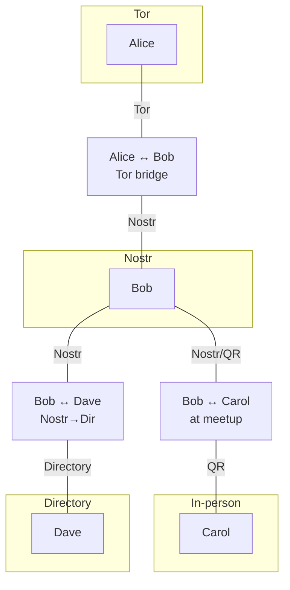

# Transport Layer

## Layer 3: Transport — exchanging PSBTs

### The trait

```rust
trait CollaborativeMessageSet {
    type Message;
    type Error;

    /// Publish a message to all participants.
    async fn write(&self, message: Self::Message) -> Result<(), Self::Error>;

    /// Read all messages, including those from other participants.
    fn read(&self) -> impl Stream<Item = Result<Self::Message, Self::Error>>;
}
```

Each participant writes their PSBT, reads everyone's, and computes
the join locally. The trait is deliberately minimal. A new transport
is a new impl, nothing else.

### Interface specifications

For out-of-process transports, two interface specifications allow
any language to implement a transport:

**Cap'n Proto schema** for transport plugins as external binaries.
The host (`ptj`) spawns the transport process and communicates via
stdin/stdout using Cap'n Proto RPC. The transport binary is a
capability: it can read and write messages, nothing else.

```capnp
interface Transport {
    write @0 (message :Data) -> ();
    read  @1 () -> (stream :MessageStream);
}

interface MessageStream {
    next @0 () -> (message :Data, done :Bool);
}
```

**WIT (WASM Interface Types)** for transport plugins as WASM
components. The host loads the transport as a WASM component and
calls it through the WIT interface. Object capabilities are
enforced by the WASM sandbox: the transport can only do what the
host grants it.

```wit
interface transport {
    write: func(message: list<u8>) -> result<_, string>;
    read: func() -> list<list<u8>>;
}

world ptj-transport {
    export transport;
}
```

WASM components are portable (any OS, any architecture), sandboxed
(no filesystem, no network unless granted), and composable (chain
transports, add encryption, add logging). This is the future:
wallets ship transport plugins as `.wasm` files, users mix and
match without trusting native code.

### High-impact transports

These cover the most users with the least integration effort.

#### Payjoin Directory (linked mailboxes)

The `DirectoryLinkedMailbox` from rust-payjoin. Mailbox IDs derived
from `H(shared_secret || index)`. Writers walk forward on HTTP 409
(collision). Readers poll sequentially until timeout.

```
✅ OHTTP metadata privacy (relay can't read content or identify peers)
✅ Existing infrastructure (payjoin directory servers already deployed)
✅ Async (offline delivery)
✅ Simple implementation (~200 lines)
⚠️ Polling, not push
⚠️ Single directory = availability risk
⚠️ Mailbox fingerprinting (all participants read all slots)
```

Future: server-side append semantics (one mailbox, concatenated
writes), set reconciliation (minisketch/IBLT), sharding across
directories. See the discussion on
[rust-payjoin PR #5](https://github.com/0xZaddyy/rust-payjoin/pull/5).

**Best for:** Privacy-focused users, payjoin ecosystem integration.

#### Animated QR codes

Two phones (or phone + hardware wallet) face each other. The PSBT
is fountain-coded across animated QR frames. No network, no files,
completely air-gapped.

PSBTs are typically 1-10 KB. At 30 fps with ~2 KB per frame
(high-density QR), a 5 KB PSBT transfers in under a second. Larger
transactions (many inputs) take a few seconds.

Existing implementations: Sparrow Wallet, Keystone hardware wallet,
URs (Uniform Resources from Blockchain Commons). The UR standard
provides fountain codes over QR with error correction and
multi-part sequencing.

```
✅ Air-gapped (no network at all)
✅ Works with hardware wallets
✅ No installation on the scanning side (camera app)
✅ Visual confirmation ("I can see it working")
❌ Requires physical proximity
❌ Two-way exchange needs two cameras
```

**Best for:** Hardware wallet users, security-maximalist setups,
in-person transactions.

#### Nostr (mdk / whitenoise)

NIP-44 encrypted DMs for two-party. MLS groups via whitenoise/mdk
for multi-party. Relays provide redundancy and offline delivery.

```
✅ Async (push notifications possible via relay-specific mechanisms)
✅ Relay redundancy (write to multiple, read from any)
✅ Identity reuse (npub = long-term identity)
✅ MLS forward secrecy for group sessions
✅ Large existing user base
⚠️ Relay metadata (who talks to whom, timing)
⚠️ MLS adds complexity for multi-party
```

The npub serves double duty: layer 1 (addressing, via NIP-05) and
layer 2 (introduction, via NIP-44 DM). A wallet that already uses
nostr for contacts gets collaborative transactions for free.

**Best for:** Nostr-native wallets, recurring collaborators,
mobile wallets with push notification support.

#### WebRTC (browser)

No installation. A web page at `ptj.dev/join/CODE` runs the lattice
join in WASM. The signaling server sees connection metadata but not
content (DTLS encrypted peer-to-peer).

```
✅ Zero installation (works in any browser)
✅ Lowest barrier to entry
✅ E2E encrypted (DTLS)
✅ P2P after signaling (low latency)
⚠️ Signaling server metadata
⚠️ Browser security model (no hardware wallet integration)
⚠️ WASM PSBT signing requires key in browser memory
```

The web page could be a "join this transaction" link that the
recipient opens. The sender's wallet connects via WebRTC. The
lattice join runs in WASM on both sides.

**Best for:** Onboarding new users, casual transactions, "just
send them a link" UX.

### Additional transports

These serve specific niches or provide defense in depth.

#### Iroh (documents)

Each peer publishes their PSBT as an iroh document entry. Iroh's
set reconciliation protocol (range-based sync) ensures all peers
eventually converge.

```
✅ True P2P (no central server required)
✅ Efficient sync (delta-only)
✅ NAT traversal via iroh relay
✅ Late joiners catch up automatically
❌ Both peers must be online (or use relay)
❌ No offline delivery
```

**Best for:** Desktop wallets, developers, P2P-maximalist setups.

#### Tor onion services

Each peer runs a hidden service. No relay metadata at all. The
strongest network anonymity available.

```
✅ True anonymity (no metadata leakage)
✅ No trust in any intermediary
❌ Both peers must be online
❌ Slow to establish (~30 seconds)
❌ Tor must be installed
```

**Best for:** High-value transactions, privacy maximalists.

#### Matrix (E2E encrypted rooms)

Room = session. Olm/Megolm encryption. Already used by Bitcoin
projects for coordination.

```
✅ Async delivery
✅ E2E encrypted
✅ Bridges to other protocols
✅ Good for organizations
⚠️ Homeserver metadata
```

**Best for:** Organizations, treasury operations, teams.

#### Bluetooth / WiFi Direct

Local network, no internet. Discovery via QR code or NFC tap for
pairing. Good for in-person group coinjoins.

```
✅ No internet required
✅ Low latency
✅ NFC tap for easy pairing
❌ Proximity required
❌ Platform-specific APIs
```

**Best for:** Meetup coinjoins, point-of-sale, local groups.

#### NFC tap

Simplest possible UX for small PSBTs. Tap phones together. Android
supports host card emulation. Limited payload but PSBTs compress
well. Two taps: one to send, one to receive the joined result.

**Best for:** Quick two-party transactions, mobile-first UX.

#### Email (PGP/age encrypted)

The original async transport. `ptj` reads PSBTs from stdin or
attachments. Everyone has email. Lowest common denominator.

```
ptj join <(gpg -d alice.psbt.gpg) <(gpg -d bob.psbt.gpg)
```

**Best for:** Fallback, compatibility, non-technical users.

#### IPFS / IPNS

Publish PSBT to IPFS, share the CID. Content-addressed: anyone
with the CID can retrieve from any node. IPNS for mutable pointers.

**Best for:** Public/transparent collaborative transactions,
crowdfunding, auditable construction.

#### Meshtastic / LoRa / Reticulum

Off-grid mesh networking. Very low bandwidth (~200 bytes/sec) but
PSBTs compress to a few KB. Works without internet infrastructure.
Reticulum is transport-agnostic (LoRa, serial, TCP, I2P).

**Best for:** Disaster scenarios, remote areas, extreme censorship
resistance.

## Transport bridging

A peer connected to two transports is a bridge. They read PSBTs
from one transport and write them to the other. The lattice join
makes this free: no translation, no conflict resolution, no
protocol negotiation. A PSBT is a PSBT regardless of how it
arrived.

### Why this works

Consider Alice (on Tor), Bob (on iroh and Tor), and Carol (on
iroh):


Alice publishes her PSBT over Tor. Bob receives it, joins it with
his own, and publishes the result on both Tor (back to Alice) and
iroh (to Carol). Carol receives AB via iroh, joins it with hers,
and publishes ABC on iroh. Bob receives ABC from Carol, publishes
it on Tor. Alice receives ABC from Bob.

Everyone converges on the same join. Bob doesn't need special
bridging logic. He's just a participant who happens to be on two
networks. Every PSBT he receives gets joined into his local state,
and his local state gets published to all his transports.

The lattice guarantees that redundant copies are absorbed
(idempotent), arrival order doesn't matter (commutative), and
partial merges compose correctly (associative). So Bob publishing
the same PSBT to both Tor and iroh is harmless. Carol receiving
it from Bob when she already has her own version is harmless.
Alice receiving AB when she already has A is just an update.

### Heterogeneous sessions

In practice, different participants will be on different transports
for different reasons:

- Alice is privacy-focused: Tor onion service, no relays
- Bob is mobile: nostr for push notifications
- Carol is at a meetup: animated QR, no internet
- Dave is an enterprise user: payjoin directory via OHTTP

Nobody needs to agree on a transport. Each participant uses
whatever they prefer. Any participant who shares a transport with
another forms a bridge. The session is the union of all transports,
connected by the participants who span them.



Bob is the hub here, but there's no coordinator role. If Bob goes
offline, Alice and Dave can still bridge through another path (or
someone can carry a file). The lattice doesn't care about topology.

### Introduction across transports

The wormhole code is transport-agnostic. When Alice creates a
session, the wormhole exchange transfers a session ticket. The
ticket can contain multiple transport endpoints:

```json
{
  "tor": "abcdef.onion:9735",
  "nostr": "npub1...",
  "directory": "https://payjo.in/session/xyz",
  "iroh": "node_id:..."
}
```

The joining peer picks whichever transport they support. If they
support multiple, they connect to all of them and act as a bridge.
The introduction mechanism (wormhole, nostr DM, QR code) is itself
independent of the transports it bootstraps.

### WASM transport composition

With WASM transport plugins, bridging becomes composition. A bridge
is a component that reads from one transport and writes to another:

```wit
world ptj-bridge {
    import source: transport;
    import sink: transport;
    export bridge: transport;
}
```

The host composes: `bridge(tor-transport, iroh-transport)`. The
bridge component reads from Tor, writes to iroh, and vice versa.
Object capabilities ensure the bridge can only access the two
transports it's given, nothing else.

This is the UNIX pipe philosophy applied to transports: small
components, composed freely, sandboxed by default.
