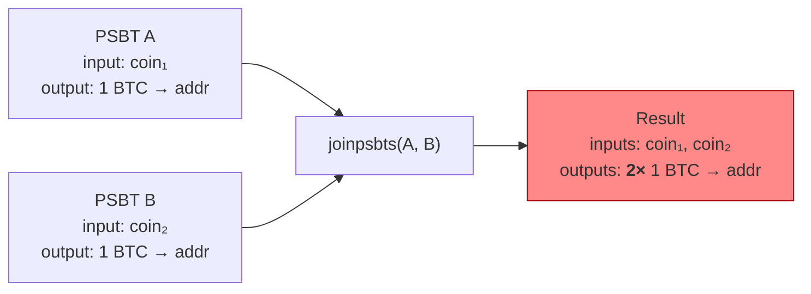
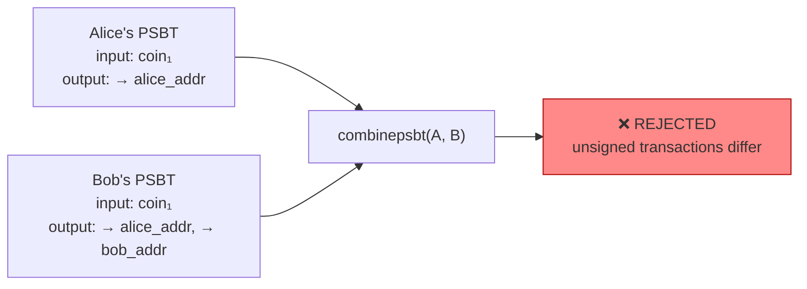
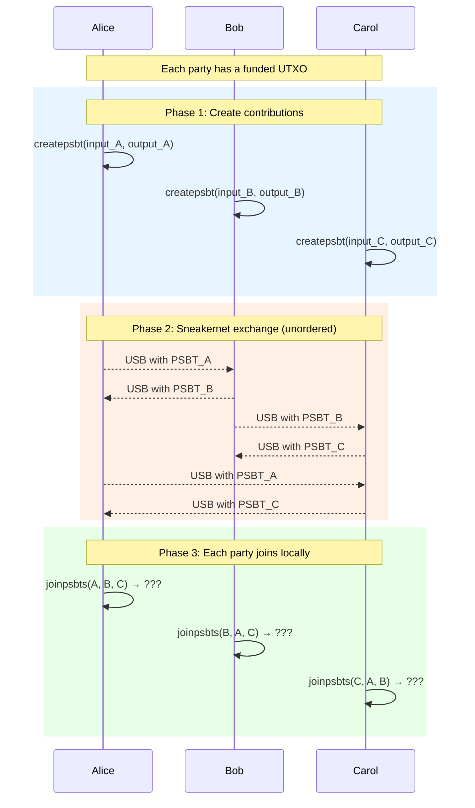
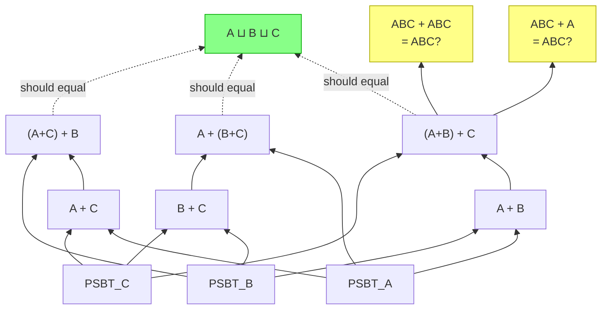
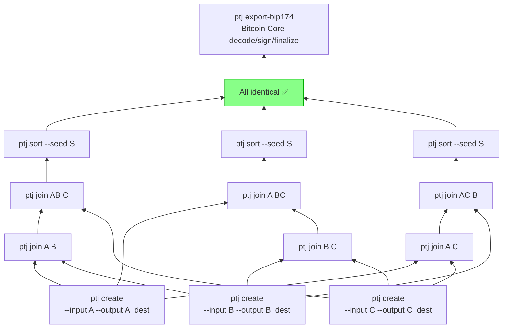

# Integration Tests

Flake checks demonstrating the motivation for concurrent-psbt and
verifying that `ptj` handles the scenarios Bitcoin Core cannot.

## `joinpsbt-gap`: Bitcoin Core's limitations

Shows two fundamental gaps in Bitcoin Core's PSBT merging:

### Gap 1: Output duplication (`joinpsbts`)

Two PSBTs with disjoint inputs but the same output destination.
`joinpsbts` duplicates the output, silently creating an overspend.

### Gap 2: Rejection of concurrent contributions (`combinepsbt`)

Two PSBTs that spend the same input but have different output sets.
`combinepsbt` rejects them because the unsigned transactions differ,
even though the intent is to merge both parties' outputs.

The script then runs `ptj` positive controls for the same protocol gaps:
`ptj join A A` keeps one input and one output, and joining two same-input
constructor contributions keeps the input once while unioning distinct outputs.

## `sneakernet-lattice`: Structural consequences

Demonstrates what happens in a realistic multi-party scenario where
copies propagate redundantly via sneakernet (USB sticks, email, etc.).

### Scenario: Three-party coinjoin

With `joinpsbts`, the results depend on who already merged what.
Overlapping inputs cause rejection. Duplicate outputs cause overspend.
The same script then runs the three-party scenario through `ptj` and checks
that all paths converge after deterministic sorting. The sorted BIP 370 PSBTs
are exported to BIP 174 before asking Bitcoin Core to decode, sign, finalize,
or broadcast them.

### Lattice property violations

| Property | `joinpsbts` | `ptj join` |
|----------|-------------|------------|
| Idempotent: `join(X, X) = X` | ❌ rejects (overlapping inputs) | ✅ |
| Commutative: `join(A, B) = join(B, A)` | ⚠️ modulo shuffling | ✅ |
| Associative: `join(join(A,B), C) = join(A, join(B,C))` | ❌ rejects | ✅ |
| Absorbing: `join(ABC, A) = ABC` | ❌ rejects | ✅ |
| Gossip-safe: `join(AB, BC, AC) = ABC` | ❌ rejects | ✅ |

## `ptj-sneakernet`: Verification

Runs the same three-party scenario using `ptj create` and `ptj join`,
verifying that all merge paths produce identical BIP 370 PSBTs after sorting
with the same seed. Each sorted PSBT is then exported to BIP 174 for Bitcoin
Core content checks and signing.

Additionally verified:

- `ptj join ABC ABC` = ABC (idempotent)
- `ptj join ABC A` = ABC (redundant copy absorbed)
- `ptj join AB BC AC` = ABC (gossip merge)
- BIP 174 export decoded by Bitcoin Core: 3 inputs, 3 outputs, 29.997 BTC of outputs on every path
- BIP 174 export signs, finalizes, broadcasts, and mines on regtest
